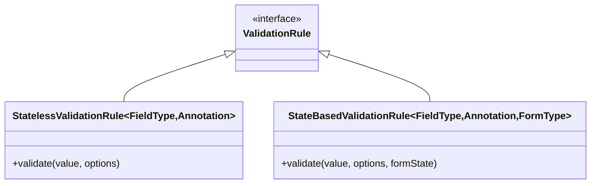

### Implementing Custom Validation Rules

If you're feeling adventuruous or need to create your own validation rule to be used with the library, you can always create one. You can use the `@FieldValiation` annotation to create custom annotations.

:::caution
You must implement the validation rules as a kotlin `object`.
:::

### Two types of validation rules

Based on your field's nature, you can implement two of the available rules 
1. `StatelessValidationRule` - used for the fields that are independently validated without referencing other fields.
2. `StateBasedVaildationRule` - used for the fields that depend on other fields for validation.




## Example

### Stateless validation rule

Let's say we're creating a custom validaton rule for Burmese Mobile numbers. We could implement our own validation logic as follows

```kotlin title="MobileNumber.kt"
@Target(AnnotationTarget.PROPERTY)
@Retention(AnnotationRetention.RUNTIME)
@MustBeDocumented
@FieldValidation(
    fieldType = String::class,
    validator = MobileNumberRule::class
)
annotation class MobileNumber(
    val country: Country
)

enum Country {
    Myanmar,
    Other
}
```

```kotlin title="MobileNumberRule.kt"
object MobileNumberRule : StatelessValidationRule<String, MobileNumber> {

    override fun validate(value: String, options: MobileNumber): FieldResult {
        
        return when (options.country) {
            Country.Myanmar -> {
                if (value.startsWith("+95")) {
                    FieldResult.Success
                } else {
                    FieldResult.Error("Burmese mobile number must start with +95", this)
                }
            }
            else -> FieldResult.Success
        }

    }

}
```

```kotlin title="SignUpFormData.kt"
@Form
data class SignUpFormData(
    
    ...

    @MobileNumber(Country.Myanmar)
    val mobilelNo: String
)
```

### State-based validation rule

Let's say we'd like to create a validator for date of birth which depends on the type of user select in another field named `userType`. Validation logic is like if `userType` is `Adult`, date of birth must be at least 13 years and above.

```kotlin title="UserType.kt"
enum class UserType {
    Adult,
    Child
}
```

```kotlin title="CustomDateOfBirth.kt"
@Target(AnnotationTarget.PROPERTY)
@Retention(AnnotationRetention.RUNTIME)
@MustBeDocumented
@FieldValidation(
    fieldType = LocalDate::class,
    validator = CustomDateOfBirthRule::class
)
annotation class CustomDateOfBirth()
```

```kotlin title="CustomDateOfBirthRule.kt"
object CustomDateOfBirthRule: StateBasedValidationRule<LocalDate, CustomDateOfBirth, SignUpFormData> {
    
    override fun validate(value: LocalDate, options: CustomDateOfBirth, formState: SignUpFormData): FieldResult {
        // Note: We're referencing the current value of `formState.userType` for validation
        return when (formState.userType) {
            UserType.Adult -> validateAdult(value)
            UserType.Child -> validateChild(value)
        }
    }

    private fun validateAdult(date: LocalDate): FieldResult {
        val minDate = LocalDate.now().minusYears(13)
        return if (date.isBefore(minDate)) {
            FieldResult.Success
        } else {
            FieldResult.Error("Adult must be older than 13.", this)
        }
    }

    private fun valildateChild(date: LocalDate): FieldResult {
        val maxDate = LocalDate.now().minusYears(13)
        return if (date.isAfter(maxDate)) {
            FieldResult.Success
        } else {
            FieldResult.Error("Child must be youngr than 13.", this)
        }
    }
}
```

```kotlin title="SignUpFormData.kt"
@Form
data class SignUpFormData(
    
    ...

    val userType: UserType

    @CustomDateOfBirth
    val dateOfBirth: LocalDate

    ...
)
```