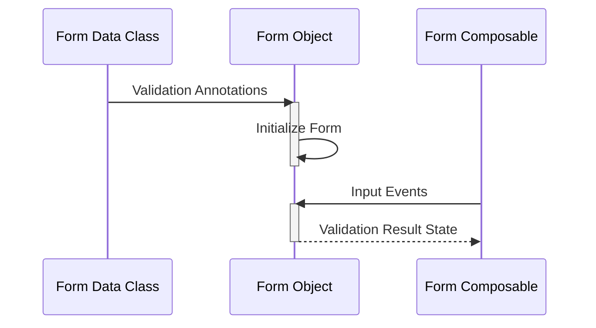

import Admonition from '@theme/Admonition';
import Tabs from '@theme/Tabs';
import TabItem from '@theme/TabItem';

## How it works

Form conductor performs validations based on the annotations on the form class. The annotations (together with the options) are converted into individual field validators under the hood, modifying the form's state as input events occur.



## Form Construction

Form construction with `formconductor` is as easy as annotating the form data class with `@Form` annotation. Every instance of a `Form` is associated to a **Form Data Class**. It is recommend to create a new data class for each type of form. Once the data class is associated to a `Form`, the library will automatically create validators for every *declared property* in the class. 

### Field Types

The library can accept every type of properties as long as it is a sub-class of `Any`. 

This includes data types such as:
1. Primitive Types (**String**, **Boolean**, **Char**, **Int**, **Long**, etc.)
2. Enums
3. Sealed classes
4. Custom classes


<Admonition type="info" icon="⛏️" title="Requirements">

* The properties (fields) must be declared as read-only variables (`val`).
* All properties should have a default value

</Admonition>


#### Example

```kotlin title="SignUpForm.kt"
@Form
data class SignUpForm(
    val name: String = "",
    val age: Int = 0,
    val emailAddress: String = "",
    val bio: String = "",
    val gender: Gender = Gender.Male,
    val address: Address? = null
    val termsAndConditionAgreed: Boolean = false
)

enum class Gender {
    Male,
    Female
}

data class Address(
    val streeet: String,
    val postalCode: String,
    val state: String
)

```

## Form Data Input

You can input data in various ways using the library. Entered data entry will be validated in real-time.


#### Using `Form.setField`

```kotlin
val form = form(SignUpFormData::class)

// highlight-next-line
form.setField(SignUpFormData::name, "Harry")
```


#### Using `FormField.setField`

```kotlin
val form = form(SignUpFormData::class)

val genderField = form.registerField(SignUpFormData::gender) // FormField<Gender>
val addressField = form.registerField(SignUpFormData::address) // FormField<Address>

// highlight-next-line
genderField.setField(Gender.Male)

// highlight-start
addressField.setField(
    Address(
        street = "128 Bird Street",
        postalCode = "11221",
        state = "Yangon"
    )
)
// highlight-end
```


#### Using `FormFieldScope.setField`

You can also set field value inside the `field` composable function, which is under the `FormFieldScope`.

```kotlin title="SignUpForm.kt"

@Composable
fun SignUpForm() {
    
    form(SignUpForm::class) {
        field(SignUpForm::name) { // FormFieldScope<String>
            TextField(
                // highlight-start
                onValueChange = {
                    setField(it)
                }
                // highlight-end
            )
        }
    }

}

```


#### Using `Form.submit`

```kotlin
val form = form(SignUpFormData::class)

form.submit(
    SignUpFormData(
        name = "Harry",
        age = 1`,
        emailAddress = "hello@example.com",
        bio = "I'm a pet lover",
        gender = Gender.Male,
        address = null
        termsAndConditionAgreed = false
    )
) // FormResult.Success or FormResult.Error
```

## Validation

Form validations are executed by the `Form` object automatically based on the annotations. All the validations are performed in real-time as you submit field values.

```kotlin title="Example Form"
@Form
data class SignUpFormData(
    ...
    @EmailAddress
    val emailAddress: String
    ...
)
```

To build a form, you can use either one of the following functions
1. `me.naingaungluu.formconductor.builder.form()`
2. `me.naingaungluu.formconductor.composeui.form()`

`me.naingaungluu.formconductor.builder.form()` is included in `:core` module and can be used as a normal function to build the form.

`me.naingaungluu.formconductor.composeui.form()` is a `@Composable` function and is included in the `:compose-ui` module to be used in composable ui's.

### Examples

#### Traditional Android UI
<Tabs groupId="example-paradigm">
  <TabItem value="declarative" label="Declarative">

  ```kotlin
import me.naingaungluu.formconductor.builder.form

...

override fun onCreate(savedInstanceState: Bundle?) {
    super.onCreate(savedInstanceState)
    
    // Declarative Form Building
    val formState = form(LoginForm::class) {

        field(LoginForm::emailAddress) { // FormFieldScope<String>
            etEmailAddress.doAfterTextChanged {
                this.setField(it)
            }
            this.resultStream.collectLatest {...}
        }

        field(LoginForm::name) { // FormFieldScope<String>
            etName.doAfterTextChanged {
                this.setField(it)
            }
        }

        this.formDataStream.collectLatest {
            btnSignUp.isEnabled = it is FormResult.Success
        }
    }
}
```

  </TabItem>

  <TabItem value="imperative" label="Imperative">

```kotlin
import me.naingaungluu.formconductor.builder.form

...

override fun onCreate(savedInstanceState: Bundle?) {
    super.onCreate(savedInstanceState)

     // Imperative Form Building
    val formState = form(LoginForm::class)
    val emailAddressState = form.registerField(LoginForm::emailAddress)
    val passwordState = form.registerField(LoginForm::password)

    etLogin.doAfterTextChanged {
        emailAddressState.setField(it)
    }
    etPassword.doAfterTextChanged {
        passwordState.setField(it)
    }

    emailAddresState.resultStream.collectLatest {
        if (it is FieldResult.Error) {
            // Handle Error
        }
    }
    
    formState.valueStream.collectLatest { result ->
        btnLogin.enabled = (result is FormResult.Success)
    }

    btnLogin.setOnClickListener {
        viewModel.login(formState.value)
    }
}
```

</TabItem>
</Tabs>

#### Jetpack Compose UI

```kotlin
import me.naingaungluu.formconductor.composeui.form

...

@Composable
fun SignUpFormScreen() {
    form(SignUpFormData::class) {

        field(SignUpFormData::name) {        
            TextField(
                value = this.state.observeAsState(),
                onValueChange = this::setField,
            )
        }

        field(SignUpFormData::emailAddress) {
            TextField(
                value = this.state.observeAsState(),
                onValueChange = this::setField
            )
        }

        val formResult = this.resultStream.observeAsState(FormResult.NoInput)

        Button(
            text = "Sign Up",
            enabled = formResult is FormResult.Success
        )
    }
}
```

### Validation Rules

You can check out the various ways to apply validation rules [here](./rules)


## Validation Results

Form validations result in two different type of results: `FormResult` and `FieldResult`. You can observe the `FieldResult` for individual field result states or the `FormResult` for the entire form validation result. 

### FormResult

`FormResult` value can be either one of the followings:
1. `FormResult.Success`
2. `FormResult.Error`
3. `FormResult.NoInput`

#### FormResult.Success

`FormResult.Success` is a sealed data class containing `data` property with filled with form data.

```kotlin title="Example"
val formResult: FormResult<SignUpFormData> = form.submit(...)

if (formResult is FormResult.Success) {
    val formData: SignUpFormData = formResult.data
}
```

#### FormResult.Error

`FormResult.Error` is a sealed data class returned when any of the validations fail for a property in the form. The class contains a `failedRules` property that holds the list of failed rules for the property.

```kotlin title="Example"
val formResult: FormResult<SignUpFormData> = form.submit(...)

if (formResult is FormResult.Error) {
    formResult.failedRules.forEach { // VaildationRule
        // handle error
    }
}
```


#### FormResult.NoInput

`FormResult.NoInput` is a special case or state when the form has no interaction at all. The form's state will always be in `FormResult.NoInput` when it's just iniitalized and there's no interaction yet.

```kotlin
val form = form(SignUpFormData::class)

val state = form.formDataStream.first() // returns FormResult.NoInput
```

### FieldResult

Quite Similarly to `FormResult`, `FieldResult` has three states nearly identical. However, the `FieldResult` represents the state of each field in the form.

`FieldResult` value can be either one of the followings:
1. `FieldResult.Success`
2. `FieldResult.Error`
3. `FieldResult.NoInput`

#### FieldResult.Success

`FieldResult.Success` is a sealed data class returned when all validations pass and there's no error.

```kotlin title="Example"
val nameField = form.registerField(SignUpFormData::name)

nameField.resultStream.collectLatest {
    if (it is FieldResult.Success) {
        // Validation Success
    }
}
```

#### FieldResult.Eror

`FieldResult.Error`is a sealed data class returned when one of the validations failed for the field. The class contains a `failedRule` property that holds the failed `ValidationRule` instance. If multiple validation rules are applied, the `failedRule` will hold the very first rule that failed.

```kotlin title="Example"
val emailAddressField = form.registerField(SignUpFormData::emailAddress)

emailAddressField.resultStream.collectLatest {
    if (it is FieldResult.Error) {
        if (it.failedRule is EmailAddressRule) {
            // Show Error
        }
    }
}
```

#### FieldResult.NoInput

`FieldResult.NoInput` is a special case or state where the field has no data input yet. It is usually the initial state of the field after it's just initialized. You'll also see this `NoInput` state when user clears the text input.

:::caution
`NoInput` is only a state and not an error indicating an empty mandatory field.
:::
